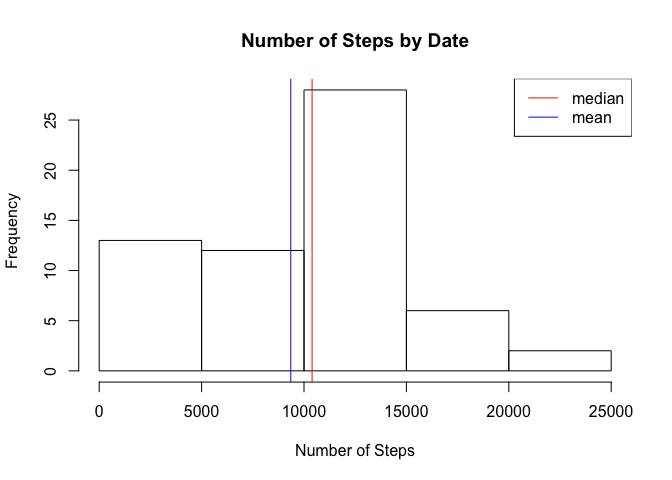
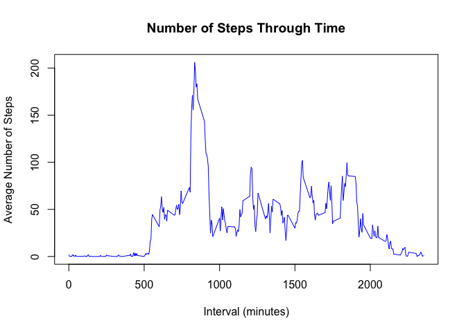
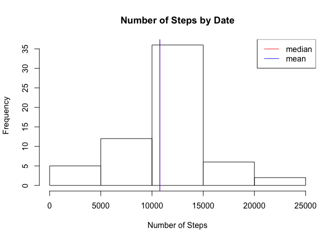
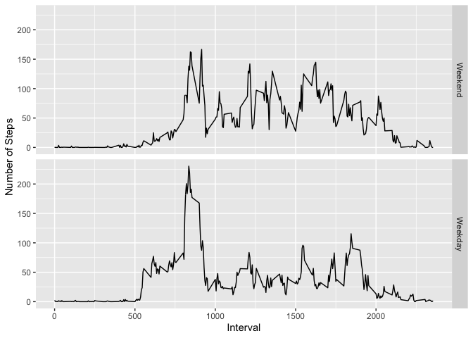

## Loading and preprocessing the data

```r
down <- download.file("https://d396qusza40orc.cloudfront.net/repdata%2Fdata%2Factivity.zip", destfile = "./data.zip")

unzip <- unzip("./data.zip", exdir = getwd())

data <- read.csv("./activity.csv")
data$date <- as.Date(data$date, "%F")
```


## What is mean total number of steps taken per day?

```r
library(plyr)
totalsteps <- ddply(data, "date", summarize, totalsteps = sum(steps, na.rm = TRUE))
hist(totalsteps$totalsteps, xlab = "Number of Steps", main = "Number of Steps by Date")
abline(v = median(totalsteps$totalsteps), col = "red")
abline(v = mean(totalsteps$totalsteps), col = "blue")
legend("topright", lty = 1, col = c("red", "blue"), legend = c("median", "mean"))
```

<!-- -->
<br/>This is the average daily step count

```r
mean(totalsteps$totalsteps)
```

```
## [1] 9354.23
```
  This is the median daily step count

```r
median(totalsteps$totalsteps)
```

```
## [1] 10395
```
## What is the average daily activity pattern?

```r
averageact <- ddply(data, "interval", summarise, avesteps = mean(steps, na.rm = TRUE))
 plot(averageact$interval, averageact$avesteps, type = "l", col = "blue", xlab = "Interval (minutes)", ylab = "Average Number of Steps", main = "Number of Steps Through Time")
```

<!-- -->
<br/>This is the 5-minute interval with the most steps

```r
averageact[which.max(averageact$avesteps),1]
```

```
## [1] 835
```
## Imputing missing values
This is the number of missing values in the dataset

```r
sum(is.na(data$steps))
```

```
## [1] 2304
```
In order to have more complete data, we must impute some values.  I chose to take an average of the values based on intervals in order to fill in the missing data.

```r
##subset data into data with NAs and complete data
na.rows <- which(is.na(data$steps))
nadata <- data[na.rows,]
comprows <- which(!is.na(data$steps))
compdata <- data[comprows,]
##calculate means based on each interval
intmean <- aggregate(steps ~ interval, compdata, mean)
##impute the means based on the interval the NA value belongs in
intmean$interval <- as.factor(intmean$interval)
nadata$interval <- as.factor(nadata$interval)
nadata$steps <- intmean$steps[nadata$interval]
##combine data
newdata <- rbind(nadata, compdata)
```
With the missing values imputed, this may imfluence some measures of central tendancy, let's look at this with a graph:

```r
newtotalsteps <- ddply(newdata, "date", summarize, totalsteps = sum(steps))
hist(newtotalsteps$totalsteps, xlab = "Number of Steps", main = "Number of Steps by Date")
abline(v = median(newtotalsteps$totalsteps), col = "red")
abline(v = mean(newtotalsteps$totalsteps), col = "blue")
legend("topright", lty = 1, col = c("red", "blue"), legend = c("median", "mean"))
```

<!-- -->
<br/>The new mean of the total steps is 

```r
mean(newtotalsteps$totalsteps)
```

```
## [1] 10766.19
```
The new median of the total steps is

```r
median(newtotalsteps$totalsteps)
```

```
## [1] 10766.19
```
By adding missing values, the median and mean are the same! Also, the mean and median both increase when compared to our values caclulated while ignoring the missing data.  
## Are there differences in activity patterns between weekdays and weekends?

```r
##create a "weekday" days character string and then create a factor variable labeling the new variable based on a logical test of the presence of the "weekday" days
weekdaysdays <- c("Monday", "Tuesday", "Wednesday", "Thursday", "Friday")
newdata$day <- factor((weekdays(newdata$date) %in% weekdaysdays), levels = c(FALSE, TRUE), labels = c("Weekend", "Weekday"))
```
<br/>Here we can see the difference in steps between weekdays and weekend days

```r
averagestep <- ddply(newdata, interval~day, summarise, steps = mean(steps))
library(ggplot2)
ggplot(averagestep, aes(as.numeric(as.character(interval)), steps)) + geom_line() + facet_grid(day~.) + ylab("Number of Steps") + xlab("Interval")
```

<!-- -->
<br/>Weekend step levels generally are more consistently moderate than step levels during weekdays.  Weeday steps spike at the beginning of the day and then drop, generally, to a level lower than the average step count on the weekend.  The weekend step levels do not reach as high of a maximum as the weekday step counts, but on average, appear to be higher than the weekday step levels.  
